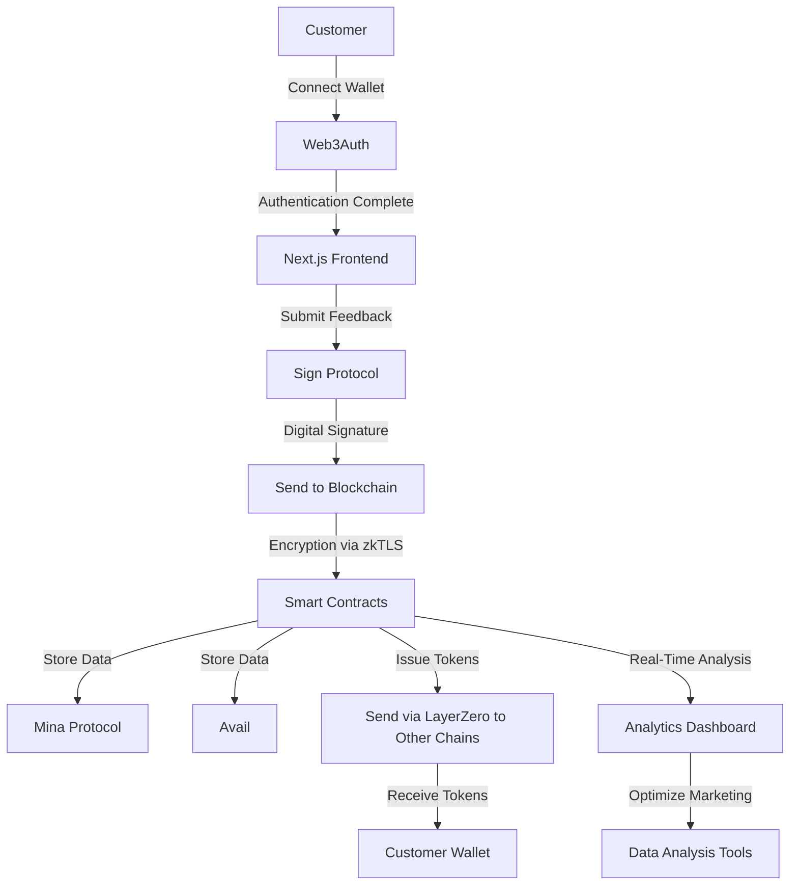

# BlockFeedback

<div style="text-align: center;">
  
</div>

## Overview

BlockFeedback is a blockchain-based real-time feedback and reward system designed for retail environments, such as convenience stores and shops. This decentralized platform allows customers to provide instant feedback on their shopping experiences and receive immediate rewards like tokens or discount coupons. By leveraging blockchain technology, BlockFeedback ensures data integrity and transparency while protecting customer privacy, enhancing consumer engagement and the quality of feedback.

**New Enhancements:**
- **Sign Protocol Integration**: Provides cryptographic signing to ensure feedback authenticity and tamper-proofing, enhancing the trustworthiness of feedback data.
- **Avail Integration**: Offers scalable data availability solutions, improving data access and performance across multiple retail locations.

## System Overview

BlockFeedback is a decentralized, blockchain-based platform designed to enhance customer engagement and data integrity in retail environments. It combines multiple cutting-edge technologies to provide a secure, efficient, and user-friendly real-time feedback and reward system. The system architecture integrates privacy-preserving protocols, cross-chain communication, and scalable data availability solutions. This ensures that both customers and store owners benefit from reliable and actionable feedback.

### System Architecture Diagram



### Key Components

1. **User Interface**: A mobile-friendly web interface built with Next.js allows customers to easily provide feedback by scanning a QR code at the store. The interface is optimized for speed and usability, ensuring a seamless user experience.

2. **Authentication**: Web3Auth is integrated to enable simple, secure, non-custodial authentication using existing social media accounts. This lowers the barrier to entry for users who may be new to blockchain technology.

3. **Feedback Submission and Security**: Feedback is collected and cryptographically signed using **Sign Protocol**, ensuring authenticity and preventing tampering. Data is encrypted and transmitted securely using **zkTLS**, providing an additional layer of privacy and security.

4. **Blockchain Storage**: Feedback data is stored using the **Mina Protocol**, known for its lightweight and privacy-preserving blockchain capabilities. This ensures that feedback is kept secure and anonymous, protecting user identities.

5. **Data Availability**: **Avail** is used to manage scalable data storage and availability, enhancing the performance and reliability of the system across multiple retail locations. This makes feedback data accessible for real-time analysis and reporting.

6. **Reward Distribution**: Smart contracts developed with Foundry handle the issuance of tokens or coupons as rewards. By utilizing **LayerZero** for cross-chain compatibility, rewards can be distributed across various blockchain networks, providing flexibility and scalability.

7. **Real-Time Analytics**: Store owners have access to a comprehensive dashboard that provides insights into customer feedback. This dashboard is built using data visualization tools that aggregate and display feedback, enabling data-driven decisions for marketing and customer service improvements.

### Summary

BlockFeedback combines the strengths of blockchain technology with advanced security and data management protocols to create a robust feedback system.
The system integrates Sign Protocol to ensure data authenticity. It also uses Avail for scalable data management. These integrations provide high security, reliability, and usability. This positions BlockFeedback as a leading solution for customer engagement in the retail sector.

## Features

- **Real-Time Feedback Collection:** Customers can scan a QR code in-store to provide feedback instantly through a mobile-friendly interface.
- **Instant Rewards:** After submitting feedback, customers receive tokens or discount coupons that can be used for future purchases.
- **Secure Data Storage:** All feedback is securely stored on the blockchain, ensuring tamper-proof and verifiable data.
- **Privacy Protection:** By using zkTLS and Mina Protocol, BlockFeedback ensures that customer identities and feedback remain private.
- **Cross-Chain Compatibility:** LayerZero is used for seamless cross-chain data sharing and reward distribution.
- **User-Friendly Authentication:** Integration with Web3Auth allows easy, non-custodial login using social media accounts.
- **Feedback Authenticity:** **Sign Protocol** ensures that all feedback entries are cryptographically signed, preventing tampering and verifying the authenticity of the data.
- **Scalable Data Availability:** **Avail** provides a scalable solution for managing feedback data, ensuring that information is readily accessible and performant across different retail locations.

## How to Run the Project

### Prerequisites

- Node.js and npm installed
- Foundry for smart contract development
- A compatible web3 wallet (e.g., MetaMask)
- Next.js installed

### Installation

1. **Clone the repository:**

   ```bash
   git clone https://github.com/susumutomita/ETHOnline2024.git
   cd ETHOnline2024
   ```

2. **Install dependencies:**

   ```bash
   make install
   ```

3. **Set up environment variables:**

   Create a `.env.local` file in the root directory and add the necessary environment variables for API keys and blockchain networks.

   ```plaintext
   NEXT_PUBLIC_INFURA_PROJECT_ID=your_infura_project_id
   NEXT_PUBLIC_WEB3AUTH_CLIENT_ID=your_web3auth_client_id
   ```

4. **Start the development server:**

   ```bash
   make start
   ```

   The app should now be running on [http://localhost:3000](http://localhost:3000).

## Usage

- **Providing Feedback:** Users can scan the QR code in-store to access the feedback interface. They log in using their social media account via Web3Auth and submit feedback.
- **Receiving Rewards:** Upon submitting feedback, the smart contract issues tokens or coupons directly to the user’s wallet, usable for future purchases.
- **Analytics Dashboard:** Store owners can access a dashboard to view and analyze feedback, facilitating data-driven decision-making.

## Technologies Used

- **Next.js:** For building the frontend interface.
- **Foundry:** For developing and deploying smart contracts.
- **zkTLS:** For secure, encrypted data communication.
- **Mina Protocol:** For privacy-preserving feedback collection.
- **LayerZero:** For cross-chain data sharing and reward distribution.
- **Web3Auth:** For non-custodial authentication and easy login.
- **Sign Protocol:** For cryptographic signing of feedback to ensure data authenticity and integrity.
- **Avail:** For scalable data availability and performance optimization across retail locations.

## Future Roadmap

1. **Scalability Improvements:** Optimize the platform for higher feedback volumes.
2. **Expansion to More Retail Chains:** Broaden the deployment of BlockFeedback to more retail partners.
3. **Enhanced Analytics:** Introduce advanced features for deeper insights into customer feedback.
4. **Mobile App Development:** Create native mobile applications for a seamless user experience.

## Contributing

We welcome contributions to improve BlockFeedback. Please fork the repository and submit a pull request with your changes.

1. Fork the repository
2. Create a new branch (`git checkout -b feature-branch`)
3. Commit your changes (`git commit -m 'Add some feature'`)
4. Push to the branch (`git push origin feature-branch`)
5. Open a pull request

## License

This project is licensed under the MIT License. See the [LICENSE](LICENSE) file for details.

## The Team

- [Susumu Tomita](https://susumutomita.netlify.app/) - Full Stack Developer
