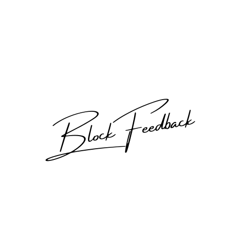
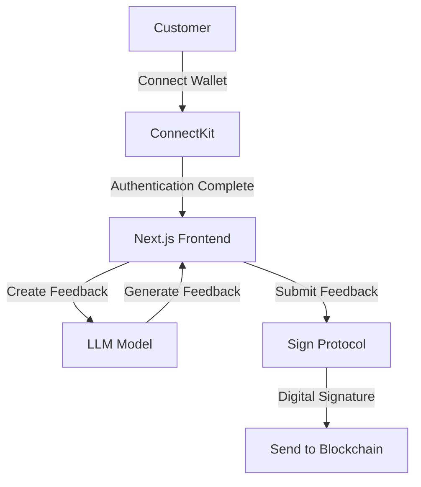

# BlockFeedback

<div style="text-align: center;">
  
</div>

## Overview

BlockFeedback is a blockchain-based real-time feedback and reward system designed for retail environments such as convenience stores and shops. This decentralized platform allows customers to provide feedback on their shopping experiences while leveraging blockchain technology to ensure data integrity and transparency.

## Screenshots


## System Overview

BlockFeedback is designed to enhance customer engagement by providing a simple, blockchain-based feedback collection system. Customers submit feedback through an easy-to-use interface, and the data is cryptographically signed to ensure its authenticity.

### System Architecture Diagram



### Key Components

1. **User Interface**: Built with Next.js, the interface allows customers to easily connect their wallets via ConnectKit and submit feedback. The design prioritizes simplicity and ease of use.
2. **Wallet Connection**: **ConnectKit** provides secure and easy wallet connection functionality.
3. **Feedback Submission**: Once feedback is submitted, it is cryptographically signed using **Sign Protocol**, ensuring that the data cannot be tampered with.
4. **LLM-powered Feedback Generation**: Feedback is generated using LLM models (Ollama locally, Groq in the cloud) to provide additional features for content creation.
5. **Blockchain Storage**: Feedback data is securely stored on the blockchain, ensuring transparency and immutability.

### Summary

BlockFeedback utilizes blockchain technology to provide a secure, reliable feedback collection system. The integration of **Sign Protocol** ensures the authenticity of feedback data, while **ConnectKit** makes it easy for users to connect their wallets. The use of LLM models enhances the feedback generation process.

## Features

- **Real-Time Feedback Collection**: Customers can provide feedback instantly after connecting their wallets through the interface.
- **LLM-Powered Feedback Generation**: Feedback is generated using Ollama for local environments and Groq for cloud environments.
- **Secure Data Storage**: Feedback is stored on the blockchain, ensuring data integrity and transparency.
- **Easy Wallet Authentication**: Users can securely and quickly connect their wallets using **ConnectKit**.
- **Feedback Authenticity**: All feedback is cryptographically signed using **Sign Protocol**, ensuring tamper-proof data.

## How to Run the Project

### Prerequisites

- Node.js and npm installed
- Foundry for smart contract development
- A Web3-compatible wallet (e.g., MetaMask)
- Next.js installed

### Installation Steps

1. **Clone the repository**:

   ```bash
   git clone https://github.com/susumutomita/ETHOnline2024.git
   cd ETHOnline2024
   ```

2. **Install dependencies**:

   ```bash
   make install
   ```

3. **Set up environment variables**:

   There are different environment variables for using **Ollama** in a local environment and **Groq** in a cloud environment. Switch between environments using the `NEXT_PUBLIC_ENVIRONMENT` variable.

   - Local environment (using LLama 3.1):

   ```plaintext
   ollama + llama3.1 setup required.
   ```

   - Cloud environment (using Groq):

   ```plaintext
   NEXT_PUBLIC_ENVIRONMENT=production
   GROQ_API_KEY=your_groq_api_key
   ```

4. **Start the development server**:

   ```bash
   make start
   ```

   The app will be running at [http://localhost:3000](http://localhost:3000).

## Technologies Used

- **Next.js**: Used for building the frontend interface.
- **Foundry**: Used for developing and deploying smart contracts.
- **ConnectKit**: Used for Web3 wallet authentication.
- **Sign Protocol**: Ensures feedback is cryptographically signed for data authenticity and integrity.
- **LLama 3.1**: Used for LLM-powered feedback generation in local environments.
- **Groq**: Used for LLM-powered feedback generation in cloud environments.

## Future Roadmap

1. **QR Code Scanning Feature**: Add a feature where users can scan a QR code to easily submit feedback.
2. **Token Distribution Feature**: Implement a feature that automatically issues tokens or coupons as rewards for feedback submission.
3. **Expand to More Retail Chains**: Broaden BlockFeedback’s deployment to additional retail partners.
4. **Advanced Analytics**: Add features to gain deeper insights into customer feedback.
5. **Mobile App Development**: Develop native mobile applications for a seamless user experience.
6. **Scalability Improvements**: Optimize the platform to handle larger volumes of feedback.

## Contributing

We welcome contributions to improve BlockFeedback. Please fork the repository and submit a pull request with your changes.

1. Fork the repository
2. Create a new branch (`git checkout -b feature-branch`)
3. Commit your changes (`git commit -m 'Add some feature'`)
4. Push to the branch (`git push origin feature-branch`)
5. Open a pull request

## License

This project is licensed under the MIT License. See the [LICENSE](LICENSE) file for details.

## Team

- [Susumu Tomita](https://susumutomita.netlify.app/) - Full Stack Developer
